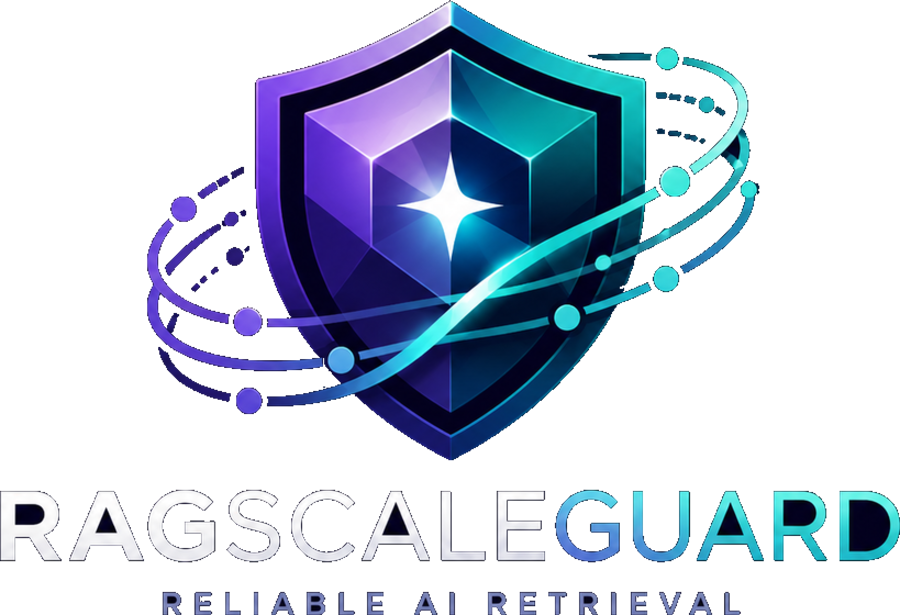

<p align="left">
  
</p>

# RAGScaleGuard

**Open-source retrieval diagnostics for enterprise RAG systems.**

RAGScaleGuard helps teams diagnose retrieval failure before the LLM generates an answer.

It is built for cases where the right document exists, but gets pushed out by dense semantic crowding, stale notes, weak metadata, duplicated documents, or conflicting internal knowledge.

It is a practical framework for comparing retrieval strategies, finding why top-k failed, testing existing RAG systems, and producing auditable reports at enterprise-like scale.

## Quick Start

```bash
python3 -m venv .venv
source .venv/bin/activate
pip install -e ".[dev]"
python examples/minimal_local_demo.py
```

To test the bundled existing-system fixture:

```bash
ragscaleguard-test --config configs/ragscaleguard-jsonl.example.json
```

## What It Does

- Measures corpus crowding and near-neighbour density.
- Compares dense-only, BM25-only, hybrid, and hybrid-plus-rerank retrieval.
- Provides authority, freshness, and metadata scoring primitives.
- Detects simple factual conflicts across retrieved evidence.
- Diagnoses cases where the answer document exists but was pushed out of top-k.
- Tests existing RAG systems through Python adapters, HTTP retrieval endpoints, or exported JSONL runs.
- Includes adapters for common LangChain, LlamaIndex, Haystack, generic retriever, HTTP, and JSONL shapes.
- Produces JSON and Markdown evaluation reports.
- Redacts common secrets and escapes corpus-controlled fields in reports.
- Provides deterministic unit tests and extension points for real embeddings, vector stores, and rerankers.

## Install

```bash
python3 -m venv .venv
source .venv/bin/activate
pip install -e ".[dev]"
pytest
```

## Minimal Demo

```bash
python examples/minimal_local_demo.py
```

## Fastest Existing-System Test

Run the ready-made JSONL example:

```bash
ragscaleguard-test --config configs/ragscaleguard-jsonl.example.json
```

Then copy that config, replace the question and retrieval-run paths, and run it against your own system export.

## Plug Into Existing RAG Pipelines

RAGScaleGuard is designed to test an existing RAG system without forcing a rewrite. There are three integration paths:

- Native Python adapters for retriever objects.
- HTTP adapter for any service that exposes a retrieval endpoint.
- JSONL adapter for systems that can export retrieved candidates.

Use `guard_retrieval` when your system already has retrieved candidates:

```python
from ragscaleguard import guard_retrieval

results = retriever.search("What changed in the rollout plan?", top_k=12)
decision = guard_retrieval("What changed in the rollout plan?", results)

if decision.should_block_generation:
    raise RuntimeError("Retrieval is not safe enough for generation")

answer = llm.generate(context="\n\n".join(decision.approved_context))
```

For retrievers that return dictionaries or document objects, wrap them with `GuardedRetriever`:

```python
from ragscaleguard.adapters import GuardedRetriever

guarded = GuardedRetriever(existing_retriever)
decision = guarded.search("What is the approved deadline?", top_k=10)
```

The guard returns pipeline stages, blocking issues, approved context, and fix suggestions. A custom suggestion provider can be attached when teams want model-generated remediation advice.

### Framework Adapters

RAGScaleGuard ships dependency-free adapters for common retriever shapes:

```python
from ragscaleguard.adapters import (
    HaystackRetrieverAdapter,
    LangChainRetrieverAdapter,
    LlamaIndexRetrieverAdapter,
)

guarded_langchain = LangChainRetrieverAdapter(langchain_retriever)
guarded_llamaindex = LlamaIndexRetrieverAdapter(llamaindex_retriever)
guarded_haystack = HaystackRetrieverAdapter(haystack_retriever)

results = guarded_langchain.search("What is the approved deadline?", top_k=10)
```

### HTTP Endpoint Testing

Any RAG system can be tested if it exposes a retrieval endpoint that accepts:

```json
{"query": "What is the approved deadline?", "top_k": 10}
```

and returns:

```json
{
  "results": [
    {
      "id": "ticket-123",
      "text": "The approved deadline is 2026-06-01.",
      "score": 0.92,
      "metadata": {"source_type": "ticket", "status": "resolved"}
    }
  ]
}
```

Run it from the command line:

```bash
ragscaleguard-test \
  --adapter http \
  --url http://127.0.0.1:8080/retrieve \
  --questions questions.jsonl \
  --report reports/http-retriever.md
```

### JSONL Export Testing

If the existing system cannot expose an endpoint, export retrieval results as JSONL:

```jsonl
{"query":"What is the approved deadline?","results":[{"id":"ticket-123","text":"The approved deadline is 2026-06-01.","score":0.92}]}
```

Then run:

```bash
ragscaleguard-test \
  --adapter jsonl \
  --retrieval-runs retrieval-runs.jsonl \
  --questions questions.jsonl \
  --report reports/exported-runs.md
```

See [docs/integrations.md](docs/integrations.md) for the full adapter guide.

You can also put the same settings in a config file:

```bash
ragscaleguard-test --config configs/ragscaleguard-jsonl.example.json
```

## How Is This Different From RAG Evaluation Tools?

RAGScaleGuard is not a replacement for Ragas, DeepEval, LangSmith, Phoenix, or Langfuse.

Those tools are strong for evaluation, tracing, and observability.

RAGScaleGuard focuses on a narrower problem:

**Why did retrieval fail before the LLM generated an answer?**

It is designed to inspect retrieval failure modes such as:

- Top-k displacement.
- Dense semantic crowding.
- Stale or low-authority evidence.
- Conflicting documents.
- Metadata and freshness failures.
- Unsafe context passed to generation.

It can be used alongside existing evaluation and observability tools.

## Dashboard Demo

Open `examples/dashboard/index.html` in a browser to try a local interactive dashboard. It uses static sample values, local JavaScript, and no external network calls.

To serve it locally:

```bash
python examples/serve_dashboard.py
```

When served locally, dashboard events and error states are written to `reports/dashboard-events.jsonl`.
The local event endpoint accepts only bounded JSON events, redacts common secret fields, and rotates the event log before unbounded growth.

### Visual Walkthrough

The dashboard is designed to show the retrieval path, current quality, candidate evidence, fault states, and optional local adviser output without needing a remote service.


Run the simulation to watch the pipeline move from query intake through retrieval, density analysis, reranking, conflict checks, validation, and approved context.


Broken or risky stages turn red automatically, including the progress bar, affected pipeline nodes, metric cards, and recommendations.


Full details mode exposes the operational view used for investigation: stage status, bottlenecks, fix suggestions, adapter output, adviser controls, review toggles, and the local event log.


See [docs/dashboard_walkthrough.md](docs/dashboard_walkthrough.md) for a short guide to each dashboard area.

## Local Corpus Evaluation

RAGScaleGuard can evaluate any local enterprise-style corpus represented as JSONL documents and questions. It does not bundle or require external corpora.

```bash
python examples/run_local_corpus.py \
  --documents /path/to/documents.jsonl \
  --questions /path/to/questions.jsonl \
  --report reports/local-corpus.md
```

Expected document fields are `id`, `text`, and optional `source_type`, `created_at`, `updated_at`, `author`, `project`, `customer`, `ticket_id`, `department`, `status`, and `is_verified`.

Expected question fields are `id`, `question`, and optional `ground_truth_document_ids`.

## Current Limitations

- The built-in dense retriever is a deterministic hashing baseline for reproducible tests, not a production embedding model.
- Conflict detection is conservative and rule-based.
- Generated-answer faithfulness is represented by citation and retrieval metrics until a user supplies an evaluator.
- RAGScaleGuard does not auto-discover private enterprise auth, schemas, prompts, or vector stores. Teams connect through the adapter contract, HTTP endpoint, or JSONL export.
- Large-corpus performance depends on the backing retriever, vector store, and endpoint used by integrators.

See [docs/architecture.md](docs/architecture.md), [docs/integrations.md](docs/integrations.md), [docs/evaluation_methodology.md](docs/evaluation_methodology.md), [docs/limitations.md](docs/limitations.md), and [docs/security_governance.md](docs/security_governance.md).

## Licence and Trademarks

RAGScaleGuard is released under the MIT licence.

The RAGScaleGuard name, shield logo, cube/orbit mark, and "Reliable AI retrieval" lock-up are official project branding. See [TRADEMARKS.md](TRADEMARKS.md) before redistributing modified versions or using the marks outside this project.
