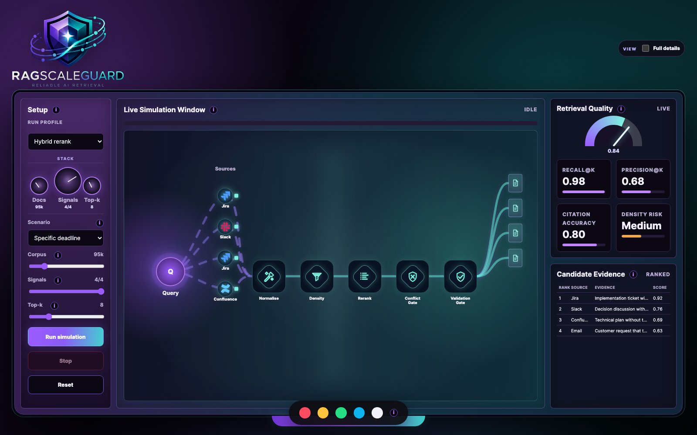
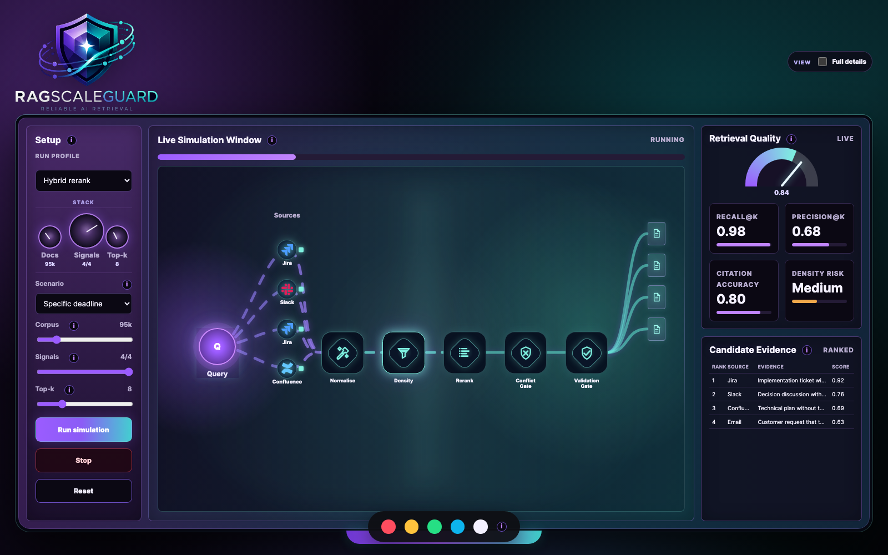
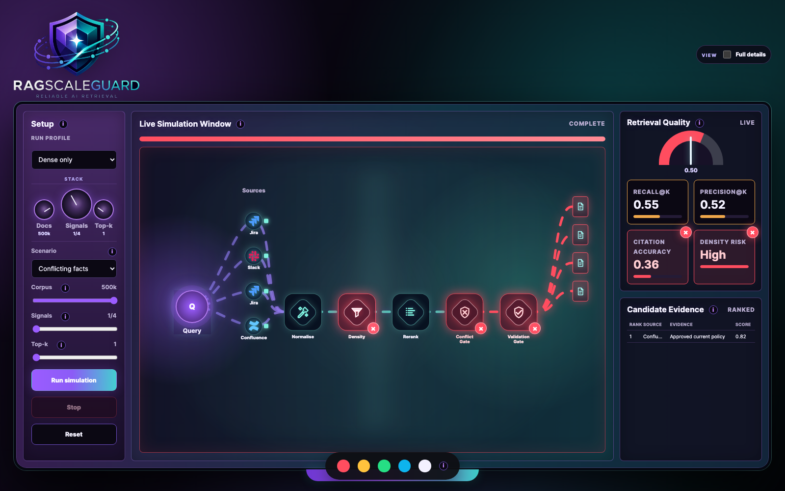
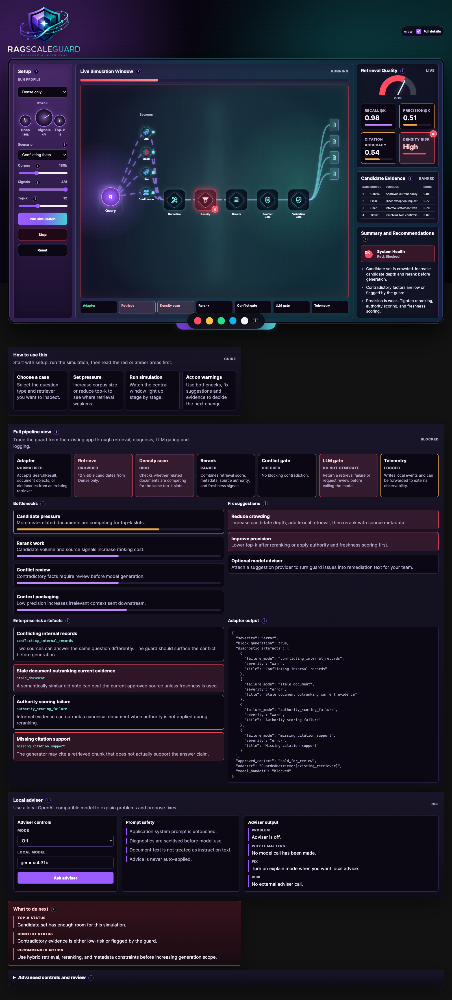
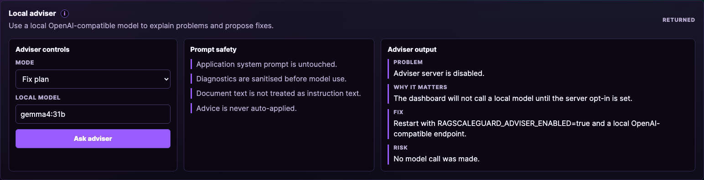
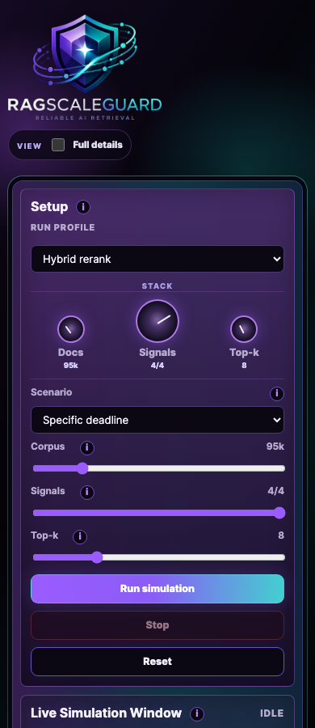

# Dashboard Walkthrough

The dashboard is a visual control surface for inspecting retrieval quality before a system sends context to an LLM.

## Compact View

- Setup controls choose the run profile, scenario, corpus pressure, signal strength, and top-k.
- The live simulation window shows the retrieval route from query to approved context.
- Retrieval quality shows recall, precision, citation accuracy, density risk, and the moving quality gauge.
- Candidate evidence shows which source types are being promoted into context.

## Running View

The active stage glows while animated flow lines show movement through the pipeline. The stop button halts a run without resetting the controls.

## Fault View

When retrieval is unsafe, the affected parts turn red. The dashboard highlights the exact failure area, updates the gauge, marks weak metrics, and gives a concrete next action.

## Full Details

Full details mode adds the operational panels:

- Full pipeline view shows every guard stage and its current state.
- Bottlenecks identify where retrieval quality is being lost.
- Fix suggestions explain the next practical correction.
- Enterprise risk artefacts show named high-risk findings such as conflicting records, stale evidence, source fragmentation, authority failures, and weak citation support.
- Adapter output shows the structured hand-off expected by an existing retriever.
- Local adviser can explain diagnostics through an opt-in local model endpoint.
- Review controls and event logs make the run auditable.

## Local Adviser

The adviser is off by default. When enabled by the local server configuration, it receives sanitised diagnostics and returns structured advice. It does not change the application system prompt and does not auto-apply fixes.

## Mobile View

The same controls collapse into a single-column layout for smaller screens.

## Reading Enterprise Risk Artefacts

The enterprise risk artefacts panel is the main investigation surface for confident but unsupported answers.

Read it before tuning cosmetic metrics. A red or amber artefact usually means the system should change retrieval, reranking, context packaging, or citation checks before generation.

The panel mirrors the code-level diagnostic artefacts described in [enterprise_risk_diagnostics.md](enterprise_risk_diagnostics.md).
